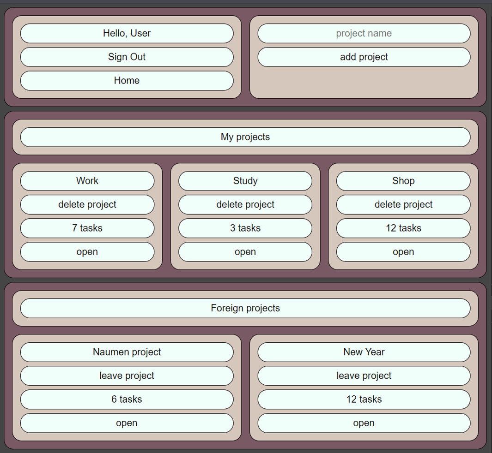
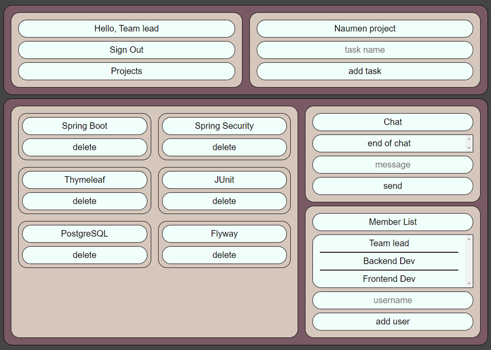

## Функционал проекта
Проект представляет собой веб-сервис для совместной работы.
Сервис позволяет создавать проекты, добавлять в них задачи и участников.
Для общения в рамках проекта предусмотрен внутренний чат.

## Скриншоты проекта
#### Страница списка проектов

#### Страница проекта

## Используемые технологии
1. Spring (Boot, Security, Data, Test)
2. PostgreSQL
3. Flyway
4. Lombok
5. Thymeleaf
6. js (fetch) / html / css

## Для запуска проекта необходимо
1. PostgreSQL с двумя пустыми БД: todo и todo-test
2. Изменить пароль пользователя postgres в [application.properties](./ToDoList/src/main/resources/application.properties) и в соответствующем файле в пакете с тестами ([application.properties](./ToDoList/src/test/resources/application.properties))
3. Проект запускается на [локальном сервере](http://localhost:8080/home)